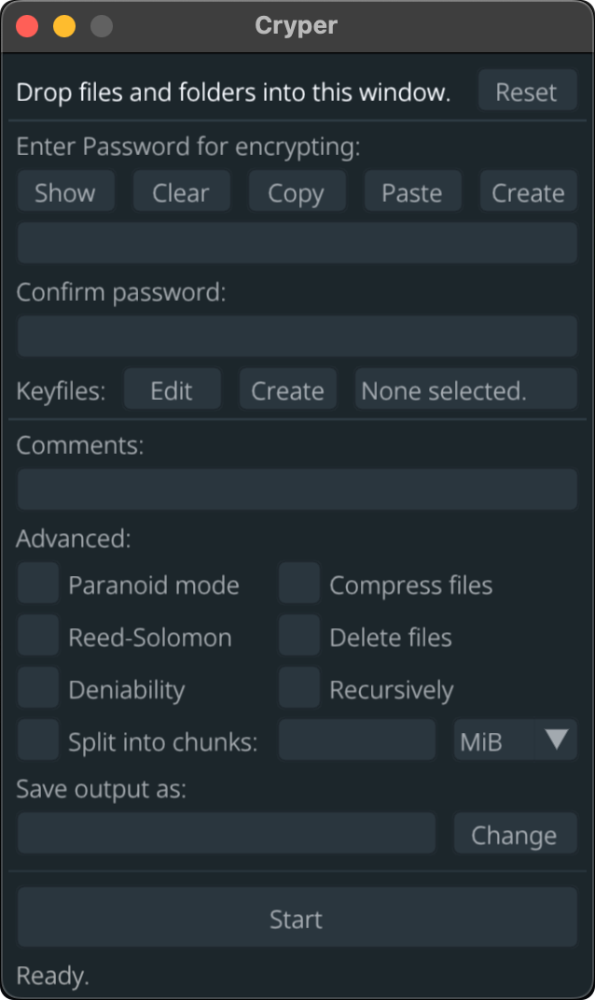

# Cyper-Encryption-and-Decryption

  

It's designed to be the <i>go-to</i> tool for encryption, with a focus on security, simplicity, and reliability. Cryper uses the secure XChaCha20 cipher and the Argon2id key derivation function to provide a high level of security, even from three-letter agencies like the NSA. <strong>Your privacy and security is under attack. Take it back with confidence by protecting your files with Cryper.</strong>

# Comparison
Here's how Cryper compares to other popular encryption tools.

|                | Cryper      | VeraCrypt      | 7-Zip GUI      | BitLocker      | Cryptomator    |
| -------------- | -------------- | -------------- | -------------- | -------------- | -------------- |
| Free           |✅ Yes         |✅ Yes          |✅ Yes         |✅ Bundled      |✅ Yes         |
| Open Source    |✅ GPLv3       |✅ Multi        |✅ LGPL        |❌ No           |✅ GPLv3       |
| Cross-Platform |✅ Yes         |✅ Yes          |❌ No          |❌ No           |✅ Yes         |
| Size           |✅ 3 MiB       |❌ 20 MiB       |✅ 2 MiB       |✅ N/A          |❌ 50 MiB      |
| Portable       |✅ Yes         |✅ Yes          |❌ No          |✅ Yes          |❌ No          |
| Permissions    |✅ None        |❌ Admin        |❌ Admin       |❌ Admin        |❌ Admin       |
| Ease-Of-Use    |✅ Easy        |❌ Hard         |✅ Easy        |✅ Easy         |🟧 Medium      |
| Cipher         |✅ XChaCha20   |✅ AES-256      |✅ AES-256     |🟧 AES-128      |✅ AES-256     |
| Key Derivation |✅ Argon2      |🟧 PBKDF2       |❌ SHA-256     |❓ Unknown      |✅ Scrypt      |
| Data Integrity |✅ Always      |❌ No           |❌ No          |❓ Unknown      |✅ Always      |
| Deniability    |✅ Supported   |✅ Supported    |❌ No          |❌ No           |❌ No          |
| Reed-Solomon   |✅ Yes         |❌ No           |❌ No          |❌ No           |❌ No          |
| Compression    |✅ Yes         |❌ No           |✅ Yes         |✅ Yes          |❌ No          |
| Telemetry      |✅ None        |✅ None         |✅ None        |❓ Unknown      |✅ None        |
| Audited        |❌ [Donate](https://opencollective.com/Cryper)     |✅ Yes          |❌ No          |❓ Unknown      |✅ Yes         |

Keep in mind that while Cryper does most things better than other tools, it's not a one-size-fits-all and doesn't try to be. There are use cases such as full-disk encryption where VeraCrypt and BitLocker would be a better choice. So while Cryper is a great choice for the majority of people, you should still do your own research and use what's best for you.
